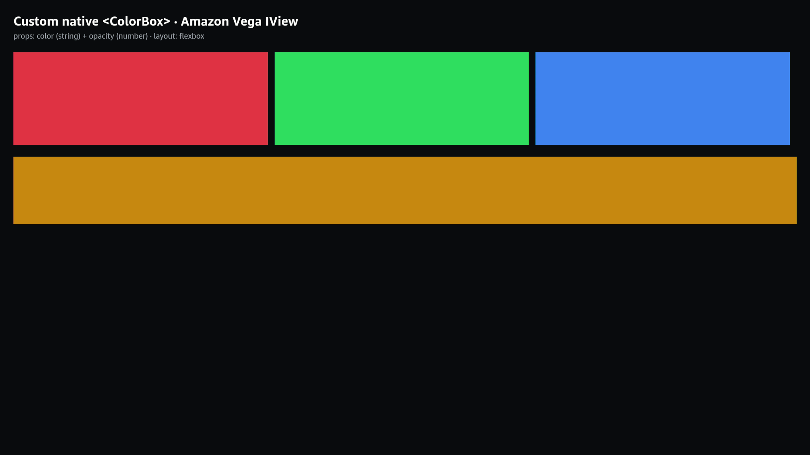

# Minimal custom IView (Fabric component) for Amazon Vega

A tiny, **verified-on-device** reference for building a custom native UI component
(`IView`) for Amazon Vega / Kepler (Fire TV), driven from React Native. Amazon
ships an `IViewManager` *guide* but no runnable example — this is one, kept as
small as possible while still exercising the parts a real component needs:

- **props (string)** — `color="#RRGGBB"` → native `setBackgroundColor`
- **props (number, live-updating)** — `opacity={0..1}` → native `setOpacity`
- **layout** — React flexbox sizes each native view via `ILayoutDelegate`
- **multiple instances** of one component

The component, `<ColorBox>`, is just a native view whose background color +
opacity come from props and whose size comes from the React layout.



> Verified on a physical Fire TV (`armv7`): three `<ColorBox>` in a flex row
> (red/green/blue) + a full-width amber box with animated opacity.

## How it works

A custom Vega component is an **in-process APMF component** that implements the
UI-Toolkit *react* delegates. KeplerScript calls them in this order:

```
IViewManagerFactory::makeViewManager(name)   // once per component name
IViewManager::makeView()                      // once per mounted instance
IPropsDelegate::registerProps(builder)        // declare the prop schema
IPropsDelegate::updateProps(view, jsObject)   // prop values (mount + updates)
ILayoutDelegate::updateLayout(view, layout)   // React-computed size
```

`ColorBoxViewManager` implements `IViewManager + IPropsDelegate + ILayoutDelegate`
(see [`kepler/ColorBoxViewManager.cpp`](kepler/ColorBoxViewManager.cpp)). The
factory registers itself with `APMF_COMPONENT("/com.example.customview", …)`.

On the JS side, [`src/ColorBox.tsx`](src/ColorBox.tsx) calls
`registerGeneratedViewConfig('ColorBox', { uiViewClassName, validAttributes })` —
`validAttributes` lists the props forwarded to native and **must match**
`registerProps()`.

## File map

| File | Role |
|---|---|
| `kepler/ViewManagerFactory.{h,cpp}` | `IViewManagerFactory` + `APMF_COMPONENT` registration |
| `kepler/ColorBoxViewManager.{h,cpp}` | the component: `makeView` / `registerProps` / `updateProps` / `updateLayout` |
| `src/ColorBox.tsx` | JS element ↔ native binding (`register` + `validAttributes`) |
| `src/App.tsx` | demo using `<ColorBox color=… opacity=… style=…/>` |
| `react-native.config.js` | autolink: `uiComponentName` + `components: ['ColorBox']` |
| `CMakeLists.txt` | imports the UI-Toolkit IDL, builds the component `.so` |
| `manifest.toml` / `app.json` | app identity (`com.example.customviewdemo`) |

## Setup

```bash
npm install
```

## Build / run / verify

```bash
D=<your-device-serial>          # e.g. a Fire TV adb serial
npx --no-install react-native build-vega --build-type Debug --target armv7
VPKG=build/private/kepler/@amazon-devices/customviewdemo/undefined/vega/armv7/Debug/@amazon-devices/customviewdemo_armv7.vpkg
vega device install-app -d $D -p "$VPKG"
vega device launch-app  -d $D -a com.example.customviewdemo.main

# logs (native code logs via syslog — surfaces here; printf/stderr/tmp do not):
vega device start-log-stream -d $D | grep ColorBox
# screen capture (composited layer):
adb -s $D shell gwsi-tool-screenshooter /tmp/x.png && adb -s $D pull /tmp/x.png
```

Targets: `armv7` (Fire TV Stick) / `aarch64` / `x86_64` (simulator).

Expected `ColorBox` log on launch:
```
[AutoLinkService] Successfully linked 'ColorBox' from app metadata
[ColorBox] registerProps
[ColorBox] makeView            (×4)
[ColorBox] updateProps color=#ef4444 / #22c55e / #3b82f6 / #f59e0b
[ColorBox] updateLayout 603x220 …  1856x160
[ColorBox] updateProps opacity=0.35 → 0.66 …   (animated)
```
